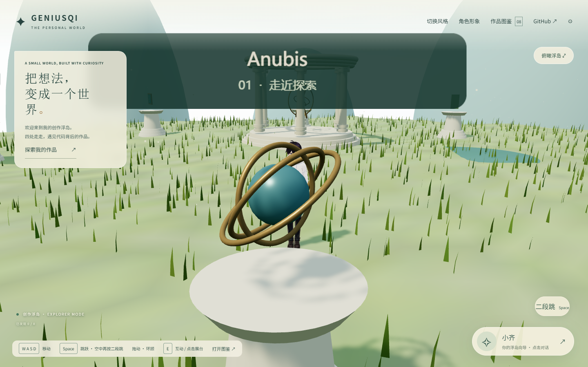
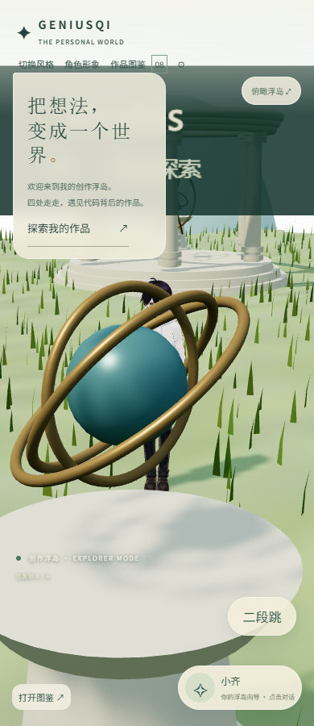

# GENIUSQI 首轮性能优化报告

## 结论

针对用户明确的「进入三维场景等待太久」，晴岚浮岛点击到可用的实验室 p75 **6623.1 → 5833.4 ms，减少 789.7 ms（11.9%）**。保留此改动。只调整碰撞准备时序，没有删减人物、场景、作品或降低精度。

**尚未推送、尚未部署。** 依用户指定 huashu-flash 的流程，待用户批准再上线。线上仍是旧版。

## 同期配对数据

时间：2026-09-27 11:03:46–11:06:38，Asia/Shanghai。A 为基线提交 `c403bd1352b8c946c86e391c7b11200ff5e442a4` 的独立正式构建，B 为仅调整 `app/world.tsx` 准备时序的正式构建；两个本机服务，A/B、B/A 交替，各 10 次，20/20 成功。

Windows + 独立无头 Edge 154.0.4258.37（Node v24.19.0），1440×900，每次新上下文、禁用缓存，Fast 4G（20 ms、下行 4 Mbps、上行 3 Mbps，包含 localhost），CPU 不限速。

| 指标 | 优化前 p50 / p75 / p95 | 优化后 p50 / p75 / p95 | p75 变化 |
|---|---:|---:|---:|
| 点击晴岚浮岛 → 可操作 | 6596.3 / 6623.1 / 7267.2 ms | 5828.2 / 5833.4 / 5853.8 ms | 减少 11.9% |
| 导航 → 场景可操作 | 7630.2 / 7649.2 / 8312.0 ms | 6864.6 / 6879.7 / 6929.5 ms | 减少 10.1% |
| 导航 → 图鉴点击成功 | 1022.2 / 1037.0 / 1047.0 ms | 1028.4 / 1035.1 / 1085.7 ms | 基本不变 |
| 主线程长任务合计 | 1262.0 / 1271.5 / 2106.6 ms | 1308.5 / 1317.8 / 1319.7 ms | 增加 3.6%，未宣称 CPU 减少 |

可用时点请求数 p75 均 15；传输字节 p75 为 3,278,181 → 3,278,189 B。成功原因是 CPU 准备工作与网络下载重叠，不是减少网络字节或降低画质。它不是 FPS 提升结论。

原始样本见 [paired-garden.json](bench/paired-garden.json)，复测命令见 [README](bench/README.md)。性能上限已从 6758.4 ms 锁定到 5833.4 ms（真实耗时容差 5%）。

## 改动与护栏

原先：环境和人物都完成后，再构建碰撞树。

现在：地形就绪就构建完全相同的碰撞树，与人物下载重叠；控制器、可用标志、进度 100% 及伙伴下载仍等两项完成。

- 正式构建、TypeScript、76 项测试通过；真实男女角色行走/转身/二段跳检查通过。
- 碰撞树 138,983 个节点、534,838 个三角形引用的完整哈希一致；480 帧控制器位置、速度、落地状态逐帧一致。可复跑 `collision-golden.mjs`。
- 固定初始场景、1440 和 390 两种宽度，前后像素差均 **0**；正文、SEO、结构化数据和链接完全相同。可复跑 `visual.py`。
- 冒烟覆盖真实点击图鉴、进入场景、移动和二段跳；雾隐山海独立一次冒烟通过。其余主题代码未改，不声称它们提速。
- 提前切走时的 disposed 分支仍释放场景，不构建已废弃的碰撞树。

固定画面是回归测试夹具：应用时间固定，手动推进三帧，暂挂后续景物/伙伴请求以对比同一初始状态；它与正常加载的性能测试分开，不用于测速。

桌面对比（前 / 后）：

窄屏对比（前 / 后）：

## 没达到的目标与限制

- 没有达到默认「p75 减半」目标。本轮仅有一个保留的应用改动，主要收益约 0.79 s；后续大头仍是模型传输与首次渲染。
- 当前测试服务器的 JS/CSS 未启用 HTTP 传输压缩，绝对秒数不能作为 CDN 线上承诺；A/B 始终同配置。冷上下文不等于清空系统/GPU 驱动缓存，交替配对降低而不能完全消除缓存和调度噪声。
- 390 宽度是窄屏布局检查，不是手机硬件/蜂窝网络实测。热缓存和不同设备的收益可能不同。
- PageSpeed 官方接口本环境返回 404，未取得 CrUX。不能据此断言本站没有真实用户数据。线上单次 HTTP 200 只证明当时可访问。
- 减少字节、骨骼遍历等候选指标未满足两次独立改动同时改善真实耗时的证明要求，未当作可泛化的代理指标。
- Brotli 省 9%～20% 但本机浏览器不支持对应原生解码；gzip 再压缩只省 1.25%～2.56%，均未应用。未引入网站依赖、付费图片服务、遥测或基础设施变更。

## 上线清单和回滚

1. 用户批准将这次改动推送并部署至既有 geniusqi.com 托管；不改 DNS/CDN/公开范围。
2. 只推送明确列入的源文件和报告，不上传 `tmp/`、基线构建、工具依赖或凭据。
3. 通过已有 Cloudflare 发布流程部署，核实 apex / www 和场景；线上按相同操作复测，带同网络对照站。未经此步不称为线上提速。
4. 如线上验证失败，撤销本次 `perf: overlap garden collision preparation with avatar download` 提交并按原部署流程重发；不使用破坏性 reset，不覆盖用户修改。

Sites 0.1.71 的本地辅助脚本当前不可访问；本次未尝试改变私有镜像发布状态，也没有使用普通 Git 凭据执行推送。正式公开站点的当前配置未动。
